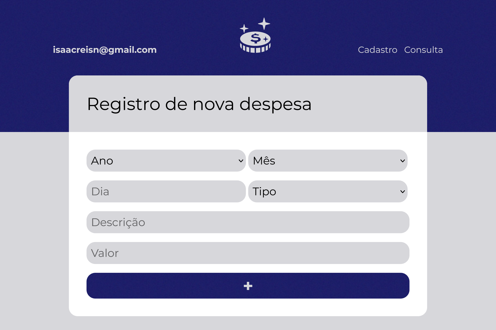

<h1 align="center">
  🤑 Orçamento Pessoal
</h1>

 

---

<a href="https://isaacnreis.github.io/orcamento-pessoal/">Acessar GitHub Pages</a>

---

### 🔧 Funcionalidades

Cadastro: cadastra uma nova despesa, sendo obrigatório preencher todos os campos: ano; mês; dia; tipo; descrição e valor. Se tentar cadastrar sem preencher um campo, aparecerá uma mensagem de erro. Se estiver válido, aparecerá uma mensagem de sucesso.

Consulta: consulta de todas as despesas cadastradas. É possível realizar o filtro das despesas de acordo com os campos informados.

---

## 👾 Tecnologias utilizadas

- HTML5
- CSS3
- JavaScript
- Visual Studio Code
- localStorage

---

## 🙋‍♂️👨‍💻 Pessoa Desenvolvedora

| [ Isaac N. Reis](https://github.com/isaacnreis) |
| :---: |

 
  
  
  

  

---